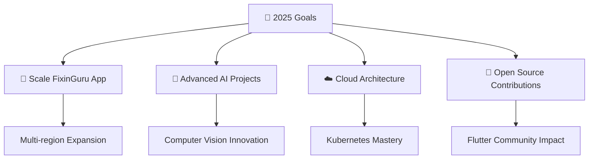

# 💫 Hey there! I'm Arjun D

<div align="center">
  
</div>


## 🚀 About Me

```yaml
name: "Arjun D"
age: 19
location: "Puducherry, India"
education: "B.Tech in AI & Data Science (2027)"
current_cgpa: 8.74
role: "Flutter Developer & Database Specialist"
company: "FixinGuru (Singapore)"
passion: ["Mobile App Development", "AI/ML", "Problem Solving"]
goal: "Building scalable solutions that impact millions"
```

🎯 **Currently Working On:** Job-marketplace mobile app serving 4 Southeast-Asian markets  
🌱 **Learning:** Advanced AI/ML techniques and cloud architecture  
💡 **Fun Fact:** Built "Jarvis" - a real-time computer vision platform with 95% accuracy!  
📊 **Impact:** Boosted service-provider engagement by 40% and reduced deployment time from hours to minutes  

<p align="center">
  
  
</p>

---

## 🛠️ Developer Tools & Utilities

<div align="center">

### 📱 **Mobile Development Showcase Tools**

<table>
<tr>
<td width="50%" align="center">

**🎮 React Native Emulator**
<br>
[](https://ArjunJr05.github.io/ArjunJr05/react-native-emulator.html)
<br><br>
*Interactive React Native app mockup generator*
<br>
Perfect for showcasing mobile apps with realistic emulator interface

</td>
<td width="50%" align="center">

**📱 Mobile Mockup Generator**
<br>
[](https://ArjunJr05.github.io/ArjunJr05/mobile-mockup-generator.html)
<br><br>
*Professional phone frame generator*
<br>
Create stunning screenshots for portfolios and presentations

</td>
</tr>
</table>

</div>

---

## 💼 Professional Experience

<details>
<summary><b>🏢 Flutter Developer & Database Specialist @ FixinGuru (Feb 2025 - Present)</b></summary>

- 🌏 **Architected** job-marketplace mobile app serving 4 Southeast-Asian markets
- ⚡ **Engineered** real-time Firestore integration processing >10,000 daily transactions (99.9% uptime)
- 🌐 **Implemented** multilingual support (Tamil, English, Chinese, Malay) - 75% market reach expansion
- 🚀 **Optimized** queries achieving 25% faster load times and 20% cost reduction
- 🔄 **Introduced** Docker-based CI/CD pipeline for automated releases

</details>

---

## 🛠️ Tech Arsenal

### 🎯 **Core Languages**


### 📱 **Mobile & Frontend**


### ⚙️ **Backend & Cloud**


### 🤖 **AI/ML & Data**


### 🗄️ **Databases**


---

## 🌟 Featured Projects

<table>
<tr>
<td width="50%">

### 🤖 [Jarvis - Computer Vision Platform](https://github.com/ArjunJr05/jarvis-ai)
**Real-time AI monitoring system**
- 🎯 **95% person identification accuracy**
- 👋 **90% gesture recognition success**
- 🎤 **Voice commands (85% ASR accuracy)**
- ⚡ **<100ms end-to-end latency**
- 🏗️ **Microservice architecture (Flask + gRPC)**

**Tech:** `Python` `OpenCV` `ML` `Speech Recognition`

</td>
<td width="50%">

### 🏦 [Advanced Banking System](https://github.com/ArjunJr05/bank-system)
**Secure concurrent banking platform**
- ✅ **99.5% transaction success rate**
- 🔐 **3-tier JWT authentication**
- 🚀 **40% faster queries**
- 💾 **30% lower memory usage**
- 🔒 **ACID compliance**

**Tech:** `Java` `JWT` `Data Structures`

</td>
</tr>
<tr>
<td width="50%">

### 📚 [StudyPy - Learning App](https://github.com/ArjunJr05/studypy)
**Python learning platform for schools**
- 🎓 **Separate teacher/student portals**
- 📊 **Real-time progress tracking**
- 💻 **Custom Python interpreter**
- 📝 **Assignment submission system**
- 🌐 **Full-stack integration**

**Tech:** `Flutter` `Python` `Render` `Backend Integration`

</td>
<td width="50%">

### 📱 [Horizontal Swiper App](https://github.com/ArjunJr05/horizontal-swiper)
**React Native horizontal scrolling interface**
- 🎨 **Beautiful gradient backgrounds**
- 👆 **Smooth swipe gestures**  
- 📱 **Cross-platform compatibility**
- ⚡ **Optimized performance**
- 🎯 **Pagination indicators**

**Tech:** `React Native` `Expo` `JavaScript`

<div align="center">
  
🎮 **[Try React Native Emulator](https://yourusername.github.io/your-repo/react-native-emulator.html)**

</div>

</td>
</tr>
</table>

---

## 🏆 Achievements & Recognition

<div align="center">

### 🥇 **Competition Wins**


### 🎯 **Competitive Programming**
| Platform | Rating | Rank | Problems Solved |
|----------|--------|------|-----------------|
| **LeetCode** | 1351 | Top 15% | 250+ problems |
| **Codeforces** | 841 | Top 25% | 50+ challenges |
| **CodeChef** | 1127 (5⭐) | Top 20% | Multiple contests |

### 📜 **Certifications**
-blue?style=flat-square)


</div>

---

## 📊 GitHub Analytics

<div align="center">


<br/>

</div>

---

## ⚡ Activity Graph

<div align="center">

</div>

---

## 🌐 Connect With Me

<div align="center">

<a href="https://linkedin.com/in/your-linkedin-profile">
  
</a>
<a href="https://github.com/ArjunJr05">
  
</a>
<a href="mailto:your.email@gmail.com">
  
</a>
<a href="https://your-portfolio-website.com">
  
</a>

</div>

---

## 🎯 Current Focus



---

<div align="center">
  
  
  ### 💭 *"Code is poetry written in logic"*
  
  **⭐ If you like my work, consider starring my repositories!**
  
  
</div>
