# 👨‍💻 Arjun D - Flutter Developer & AI Enthusiast

<div align="center">
  
  

  
  
  
  
  

</div>

---

## 🚀 About Me


```yaml
name: "Arjun D"
age: 19
location: "Puducherry, India 🇮🇳"
education: "B.Tech AI & Data Science (2027)"
current_cgpa: 8.74 / 10.0
role: "Flutter Developer & Database Specialist"
company: "FixinGuru (Singapore) 🇸🇬"
experience: "Mobile App Development, AI/ML, Cloud Architecture"
languages_spoken: ["English", "Tamil", "Hindi"]
```

### 🎯 **What I'm Up To**
- 🌏 **Building** job-marketplace app for 4 Southeast-Asian markets
- 🤖 **Developing** advanced AI/ML solutions with 95% accuracy
- ☁️ **Mastering** cloud architecture and Kubernetes
- 📚 **Learning** advanced system design and scalable architectures

### 💡 **Quick Wins**
- ⚡ **40% boost** in service-provider engagement
- 🚀 **25% faster** query performance optimization
- 🌐 **75% market reach** expansion with multilingual support
- 🔄 **Hours to minutes** deployment time reduction

---

## 🛠️ Technology Stack

<div align="center">

### **Languages & Frameworks**


### **Mobile & Frontend**


### **Backend & Cloud**


### **AI/ML & Data Science**


### **Databases**


</div>

---

## 💼 Professional Experience

<div align="center">

### 🏢 **Flutter Developer & Database Specialist**
**FixinGuru (Singapore)** | *February 2025 - Present*

</div>

<div align="left">
<table>
<tr>
<td width="50%">

**🌏 Market Impact**
- Architected job-marketplace serving 4 SE-Asian markets
- Implemented multilingual support (Tamil, English, Chinese, Malay)
- 75% market reach expansion achieved

</td>
<td width="50%">

**⚡ Technical Excellence**
- Real-time Firestore processing >10K daily transactions
- 99.9% uptime with 25% faster load times
- Docker-based CI/CD pipeline implementation

</td>
</tr>
</table>
</div>

---

## 🌟 Featured Projects

<div align="center">

<table>
<tr>
<td width="50%" align="center">

### 🤖 **Jarvis - AI Vision Platform**
[](https://github.com/ArjunJr05/jarvis-ai)

**Real-time Computer Vision System**

🎯 **95% person identification accuracy**  
👋 **90% gesture recognition success**  
🎤 **85% voice command accuracy**  
⚡ **<100ms end-to-end latency**

`Python` `OpenCV` `ML` `Flask` `gRPC`

</td>
<td width="50%" align="center">

### 🏦 **Advanced Banking System**
[](https://github.com/ArjunJr05/bank-system)

**Secure Concurrent Banking Platform**

✅ **99.5% transaction success rate**  
🔐 **3-tier JWT authentication**  
🚀 **40% faster query performance**  
💾 **30% memory optimization**

`Java` `JWT` `Concurrent Programming`

</td>
</tr>
<tr>
<td width="50%" align="center">

### 📚 **StudyPy - Learning Platform**
[](https://github.com/ArjunJr05/studypy)

**Python Learning App for Schools**

🎓 **Dual teacher/student portals**  
📊 **Real-time progress tracking**  
💻 **Custom Python interpreter**  
📝 **Assignment submission system**

`Flutter` `Python` `Backend Integration`

</td>
<td width="50%" align="center">

### 📱 **Horizontal Swiper App**
[](https://github.com/ArjunJr05/horizontal-swiper)

**React Native Scrolling Interface**

🎨 **Beautiful gradient backgrounds**  
👆 **Smooth swipe gestures**  
📱 **Cross-platform compatibility**  
⚡ **Performance optimized**

`React Native` `Expo` `JavaScript`

</td>
</tr>
</table>

</div>

---

## 🏆 Achievements & Recognition

<div align="center">

### 🥇 **Competition Victories**


### 💻 **Competitive Programming Stats**
| Platform | Rating | Global Rank | Problems Solved |
|:--------:|:------:|:-----------:|:---------------:|
| **🟠 LeetCode** | `1351` | Top 15% | 250+ solved |
| **🔵 Codeforces** | `841` | Top 25% | 50+ challenges |
| **🟤 CodeChef** | `1127 ⭐⭐⭐⭐⭐` | Top 20% | Multiple contests |

### 🎓 **Professional Certifications**
<div align="center">


</div>

</div>

---

## 📊 GitHub Analytics

<div align="center">


</div>

<div align="center">

</div>

### 📈 **Contribution Graph**
<div align="center">

</div>

---

## 🎯 Current Roadmap

```mermaid
mindmap
  root)🚀 2025 Goals(
    🌏 Scale FixinGuru
      Multi-region Expansion
      Performance Optimization
      User Growth
    🤖 AI Innovation
      Computer Vision Projects
      ML Model Optimization
      Real-time Processing
    ☁️ Cloud Mastery
      Kubernetes Expertise
      Microservices Architecture
      DevOps Pipeline
    🌟 Open Source
      Flutter Community
      AI/ML Libraries
      Developer Tools
```



---

## 🌐 Connect & Collaborate

<div align="center">

<a href="https://www.linkedin.com/in/arjun19">
  
</a>
<a href="https://github.com/ArjunJr05">
  
</a>
<a href="mailto:arjunfree256@gmail.com">
  
</a>
<a href="https://arjunjr05.github.io">
  
</a>

### 📧 **Let's Build Something Amazing Together!**

</div>

---

<div align="center">
  
  
  ### ✨ *"Innovation distinguishes between a leader and a follower"* - Steve Jobs
  
  **🌟 If my work resonates with you, consider starring my repositories!**
  
  <sub>Made with ❤️ by Arjun D</sub>
  
  
  
  
</div>
